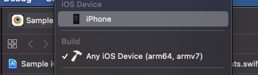
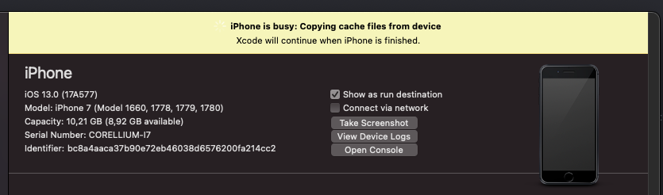
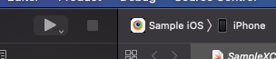

# Research summary

## Flank test run with Corellium instances (iOS)

### 1. Start VPN

Setup described [here](./README.md#vpn)

VPN is necessary only when using `USBFlux` For corellium client actions (like create an instance, upload file, etc) it is
not required.

Currently, that need to be done manually (setup and connecting)

#### :hammer:ACTION NEEDED:hammer:

Investigate how to start VPN programmatically. Which client supports the `ovpn` file. If it should be flank's responsibility
to start VPN.

### 2. Start USBFlux

Setup described [here](./README.md#usbfluxd-setup)

For macOS `USBFlux` can be started and killed with:

NOTE: it will only launch `USBFlux`, the app won't be started unless you set it up to start on launch

```
open -a USBFlux
killall USBFlux
```

When it comes to locally compiled binaries, we can use (assuming binary is in `PATH`)

```
sudo usbfluxd
sudo killall usbfluxd
```

#### :hammer:ACTION NEEDED:hammer:

How do we want to provide `USBFlux`? Should it be a user responsibility or flank? Flank could bring required files on
its own and compile if needed, but that would require additional libraries being installed on a machine. Maybe flank
should have a bunch of pre-compiled binaries?

### 3. Compile and run the script

Build script with `./gradlew shadowJar`

Run `java -jar ./corellium/corellium-sandbox/build/libs/corellium-sandbox-all.jar`

#### What example script does?

1. log in
2. find project `Amanda` and fetch its info
3. look for instance with `instance_name` (see properties file)
4. if there is no such instance -- create a new one (it takes some time)
5. wait until the instance is ready
6. create and connect an agent
7. wait until the agent is ready to use
8. upload file
9. start Xcode command
    ```
    xcodebuild test-without-building \ 
       -allowProvisioningUpdates \ 
       -allowProvisioningDeviceRegistration \
       -xctestrun [xctestrun_path] \
       -destination id=[udid]
    ```

Unfortunately, it is not working out of the box, and most likely you will get an error saying that `xcode` is unable to
find a device with provided `udid`. To make it work, proceed to the [Restart USBFlux](#4-restart-usbflux)

### 4. Restart USBFlux

If you have started `USBFlux` before running the script you need to restart it now. For some reason, `USBFlux` will not '
refresh' until a restart.

It may happen device still won't be accessible, in that case, run:

```
xcrun xctrace list devices
```

#### :hammer:ACTION NEEDED:hammer:

We should verify with the Corellium team if this is a known (and desired behavior). If possible, try to find a workaround.
Flank could also handle restart on its own, see [Action needed for USBFlux](#2-start-usbflux)

### 5. Deploy an app with Xcode

Here is where the fun begins.

Once we have an instance set up and ready, and the instance is accessible via `USBFlux` we can run the example script again. It
will start testing on the device, but most likely will throw an error:

```
Testing failed:
   SampleXCUITests:
      ... 
      (Underlying Error: A valid provisioning profile for this executable was not found.)))
```

That is happening even for binaries built from the project. So far, the only way found (that is working) is to deploy an app
with Xcode. You can use the project attached in resources.

1. open [project](./src/main/resources/Project) in Xcode
2. give it a second to find your instance (sometimes it may take a couple of seconds, sometimes Xcode restart is required)

   
3. if you still can find the instance repeat [4.](#4-restart-usbflux)
4. once your Xcode found the instance it may start copying cache files from it (~ 3,7 GB)

   
5. you can copy instance cache without Xcode, follow [these](./README.md#dyld-cache-for-the-device) steps
6. once your cache is downloaded, make sure you picked your instance as iOS Device and start the app

   
7. When the app is deployed and started you can stop in Xcode and delete it from the instance

   

#### :hammer:ACTION NEEDED:hammer:
Find out why we need to proceed with the above steps. We should investigate if there is a better way to handle `provisioning profile error`.
Copying the device cache with the script still requires an app deployment. This step needs much deeper investigation.

### 6. Run tests
When you have an instance configured you can rerun the example script, all tests should pass.

### :hammer:Final thoughts:hammer:
* Above configuration is required only once. After that, we can run tests without any problem.
* There is a feature (on Corellium) to take instances snapshots and create new devices from it. With a snapshot of the configured device, we could start/create new instances ad hoc. That would give us scalability
* Further investigation needs to be done to acquire videos from tests
* [corellium-api](https://github.com/corellium/corellium-api) client has lots of features. From a flank perspective, not all of them are necessary.
* A list of required command requests (required by flank) should be done, and we need to consult with the corellium team to get info about expected behavior, responses, etc.

## Test artifacts

### Compiled binaries

[TestApp](./src/main/resources/TestApp) directory contains already compiled binaries with `udid`

```kotlin
bc8a4aaca37b90e72eb46038d6576200fa214cc2
```

Use the below configuration if you want to use compiled binaries

```properties
plist_path=./corellium/corellium-sandbox/src/main/resources/com.apple.UIAutomation.plist
xctestrun_path=./corellium/corellium-sandbox/src/main/resources/Project/Compiled/Build/Products/SampleXCUITests_iphoneos14.4-arm64.xctestrun
udid=bc8a4aaca37b90e72eb46038d6576200fa214cc2
```

### iOS project

[Project](./src/main/resources/Project) directory contains ready to build iOS project. To build go
to [Project](./src/main/resources/Project) and run:

```
xcodebuild build-for-testing \
  -allowProvisioningUpdates \
  -project "Sample iOS.xcodeproj" \
  -scheme SampleXCUITests \
  -sdk iphoneos \
  -derivedDataPath ./Compiled
```

Then use below configuration:

```properties
plist_path=./corellium/corellium-sandbox/src/main/resources/com.apple.UIAutomation.plist
xctestrun_path=./corellium/corellium-sandbox/src/main/resources/CompiledProject/SampleXCUITests_iphoneos14.4-arm64.xctestrun
udid=[one that you used to compile, if you compiled the project with instance connected it will be instance udid ]
```
