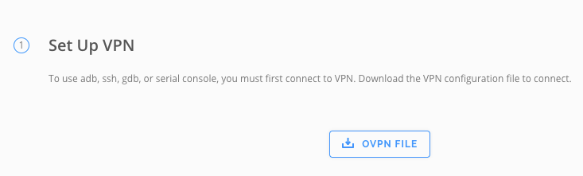
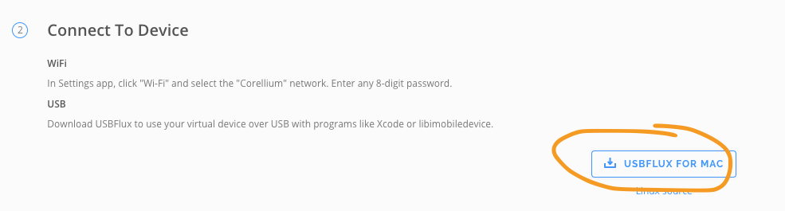

# Corellium API sandbox

## VPN

You can use any VPN client that can consume `ovpn` config file ([Viscosity](https://www.sparklabs.com/viscosity/)
, [Tunnelblick](https://tunnelblick.net/) (free))

### Viscosity configuration

**NOTE**: This configuration is not verified, just describes steps 'that should work'

1) [Download](https://www.sparklabs.com/viscosity/download/) client
2) Got to your instance view on Corellium portal and download config
   
     
3) Start `Viscosity`, load config and connect

### Tunelblick configuration

1) [Download](https://tunnelblick.net/downloads.html) and [install](https://tunnelblick.net/cInstall.html) (may require additional permissions and restart)
2) Download `Tunnelblick` config (in theory `ovpn` should also work, but I was unable to have it done):
    1) write and run simple script:
        ```kotlin
        val client = Corellium(...)
        clien.logIn()
        client.getVPNConfig(VPN.TBLK)
        ```
    2) `tblk.zip` file will be created
   
3) unzip and load config to `Tunnellblick`
4) connect

You will probably encounter some issues during configuration. Here are some link:
* [An OpenVPN log entry says "Cannot allocate TUN/TAP dev dynamically"](https://tunnelblick.net/cCommonProblems.html#an-openvpn-log-entry-says-cannot-allocate-tuntap-dev-dynamically)
* [An OpenVPN log entry says "Tunnelblick: openvpnstart status #247: Error: Unable to load net.tunnelblick.tun and/or net.tunnelblick.tap kexts in 5 tries. Status = 71"](https://tunnelblick.net/cKextLoadError.html)
* [Known Issues](https://tunnelblick.net/cKnown.html)
* [Common Problems](https://tunnelblick.net/cCommonProblems.html)

## USBFluxd setup
There are two options:
#### macOS only
1) Download `USBFlux` dmg file
   
2) install
3) start and have fun

#### linux + if above is not working
1) Clone [usbfluxd repo](https://github.com/corellium/usbfluxd)
2) [Compile](https://github.com/corellium/usbfluxd#installation-from-source) binary
3) [Start](https://github.com/corellium/usbfluxd#usage) and have fun

## Corellium client

For details please check [client documentation](../client/README.md)

## Optional Config File

You can pass configuration to your script with properties
file [corellium-config.properties](./src/main/resources/corellium-config.properties) or directly in the script.

Options:

* `api` -> your corellium portal http address, example: `example.enterprise.corellium.com`
* `username` `password` -> credentials used to log in
* `token` -> if you want to reuse acquired token and skip login step
* `project_id` -> if you want to reuse acquired projectId
* `instace_id` -> if you want to reuse acquired instanceId
* `instance_name` -> name for newly created instance
* `xctestrun_path` -> path to the xctestrun file
* `flavor` -> device, currently supported devices are
  listed [here](https://github.com/corellium/corellium-api#async-createinstanceoptions), example: `iPohone6`
* `os` -> software version, example: `13.0`
* `udid`
* `osbuild`
* `path_to_upload_plist`
* `plist_path`

Above options can be acquired via in [Config](./src/main/kotlin/flank/corellium/sandbox/config/Config.kt) file. This is
a wrapper for properties file. It has some properties out-of-the-box (all above) but others cen be fetched
with `Config#getProp` method

## Open questions

Test package has to be signed with a udid that's included in a profile. This udid must also match the device. The udid is set at boot time.

## dyld cache for the device

Use corellium tools to grab the shared cache from apples cdn. Transferring the shared cache from the device is slow.

- Run `brew install libimobiledevice`
- `git clone git@github.com:KritantaDev/corellium_tools.git`
- Invoke `./cachebuilder.sh`

Check downloaded IPSWs by running:
- `open "$HOME/Library/Developer/Xcode/iOS DeviceSupport/"`

## iPhone model mappings

`iPhone9,1` is the identifier for `iPhone 7`. `D10AP` is the internal name.

- https://www.theiphonewiki.com/wiki/Models

## Find your udid

Run `bash -l -c "$(curl -sfL https://raw.githubusercontent.com/bitrise-io/codesigndoc/master/_scripts/install_wrap-xcode.sh)"` in `xcuitest-sample-browserstack`

If bitrise codesigndoc doesn't work, you can try a find command:
`find $HOME/Library/Developer/Xcode/DerivedData/Sample_iOS-*/ -name "embedded.*"`

After exporting the provisioning profile, run `strings *.mobileprovision`. Look for the `ProvisionedDevices` section.
