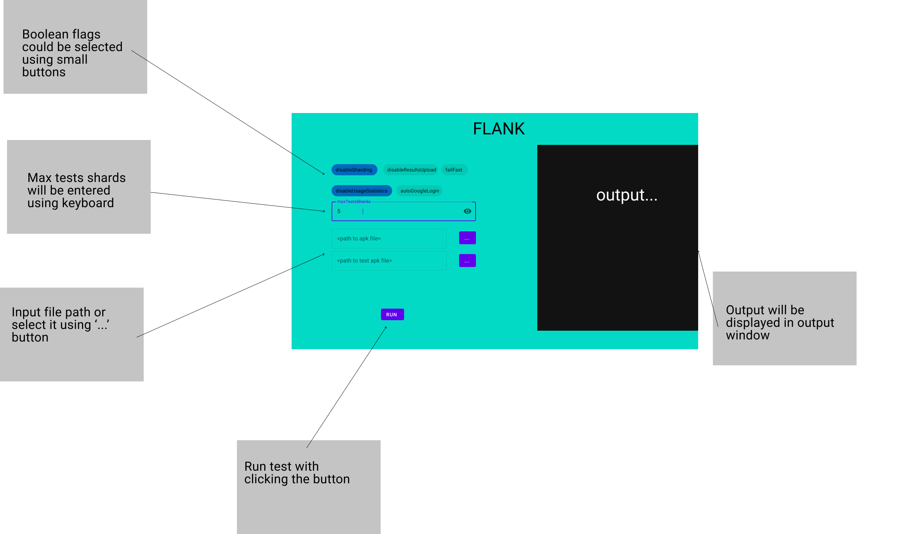

# Flank desktop prototype

## Prototype Flank options

The prototype will run a simple Android test on a given apk and test the apk with options to specify some flanks flags, as well
as max tests shards.

- Flags
  - disable sharding
  - disable results upload
  - fail fast
  - disable usage statistics
  - auto Google login

- Input
  - Max tests shards
  - apk path
  - test apk path

## Prototype design

The mockup of the design is shown below:

### Design elements

- At the top left side there are some small buttons to toggle state of boolean options
- Below there is text field to input `maxTestsShards`
- Below there are two text fields with buttons placed at the right to open file chooser/provide a path to files
- At the very bottom of left column there is a button to start Flank test run.
- On the right side there is a big window which is responsible for displaying output

## Setup

Please follow [getting started guide](https://github.com/JetBrains/compose-jb/tree/master/tutorials/Getting_Started) to set up new module for a prototype.
There is also a [gradle plugin](https://github.com/JetBrains/compose-jb/tree/master/gradle-plugins) for simplifying usage of Jetbrains compose.
More info on [project page](https://github.com/JetBrains/compose-jb/).

### Additional resources
- [IntelliJ Idea plugin](https://github.com/JetBrains/compose-jb/tree/master/examples/intelliJPlugin)
- [Tutorial](https://developer.android.com/jetpack/compose/layout)
- [Latest build](https://developer.android.com/jetpack/compose/layout)
- [Template to use without gradle](https://github.com/JetBrains/compose-jb/tree/master/templates)
